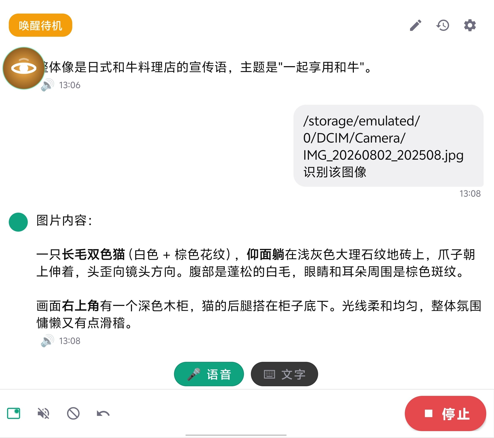

# Sherpa Voice Assistant / Sherpa 语音助手

[中文](#中文) | [English](#english)

<p align="center"></p>

An end-to-end Android voice assistant built on [sherpa-onnx](https://github.com/k2-fsa/sherpa-onnx), targeting Snapdragon (arm64) phones. Developed entirely on a phone, from Termux, without Android Studio.

> 🙏 **Special thanks to the [sherpa project](https://github.com/k2-fsa/sherpa-onnx)** ([k2-fsa](https://github.com/k2-fsa)) — its on-device speech stack (VAD / ASR / TTS) runs the entire offline voice pipeline of this app. Without sherpa-onnx, a phone-only development workflow like this would not be possible.

---

## 中文

基于 [sherpa-onnx](https://github.com/k2-fsa/sherpa-onnx) 的端到端安卓语音助手，目标骁龙（arm64）手机。全程在手机 Termux 上开发，无需 Android Studio。

<p align="center"></p>

```
说话 → [VAD 端点检测] → [ASR 语音识别] → [云端 LLM 流式] → [TTS 分句播报] → 继续聆听
       └────── 以下三项全部本地运行 (sherpa-onnx) ──────┘   ↑ 仅此项走云端
```

> 🙏 **特别感谢 [sherpa 项目](https://github.com/k2-fsa/sherpa-onnx)**（[k2-fsa](https://github.com/k2-fsa)）——本 App 的离线语音链路（VAD/ASR/TTS）完全建立在 sherpa-onnx 之上，模型与运行时全部来自该项目及其模型仓库。没有 sherpa-onnx，就没有这套纯手机开发的工作流。

### 模型选型

| 环节 | 模型 | 体积 | 说明 |
|------|------|------|------|
| VAD | silero-vad v4 | ~2MB | 端点检测，CPU 极轻量 |
| ASR | paraformer-zh-2023-09-14 (int8) | ~234MB | 中文识别，骁龙 4 线程约 100~200ms/句 |
| TTS | matcha-icefall-zh-baker + vocos | ~76MB | 中文女声(Baker)，流式合成首响快 |
| LLM | 任选 (DeepSeek/通义/智谱/OpenAI...) | 0 | OpenAI 兼容 SSE 流式 |

> ⚠️ sherpa-onnx 官方库**没有 VITS-Baker**，Baker 数据集的中文女声对应的是
> **Matcha-TTS** (`matcha-icefall-zh-baker`)。若坚持 VITS 架构，可改用
> `vits-melo-tts-zh_en`（见 `ModelPaths.kt` 注释）。

### 快速开始（Termux 编译）

```bash
# 1. 下载 sherpa-onnx AAR（含 kotlin-api 类 + 各架构 .so，~49MB）
bash scripts/download-aar.sh

# 2. 下载端侧模型到 assets（VAD+ASR+TTS，合计 ~300MB）
bash scripts/download-models.sh

# 3. 编译
./gradlew assembleDebug

# 4. 安装到本机
./install-apk.sh
```

首次 `assembleDebug` 需下载 Gradle/Kotlin 依赖，约 3~5 分钟。

### 使用

1. 打开 App → 「设置」→ 填写云端 LLM 的 **Base URL / API Key / 模型**
   - DeepSeek: `https://api.deepseek.com/v1` + `deepseek-chat`
   - 通义(DashScope 兼容): `https://dashscope.aliyuncs.com/compatible-mode/v1` + `qwen-plus`
   - 智谱: `https://open.bigmodel.cn/api/paas/v4` + `glm-4-flash`
   - 本地 agent（推荐，配套 [pi_proxy](https://github.com/Wolfpkhan/pi_proxy)）：`http://127.0.0.1:8988/v1`
2. 授予录音权限 → 「开始对话」→ 说话即可，答完自动继续聆听。
3. 状态栏颜色：🟢聆听 🟠识别 🔵思考 🟣播报。
4. 图片：消息中带上本地图片路径（选图附件），`inlineImage` 开关决定压缩成 base64 `image_url` 还是留路径给 agent 用工具读。

### 功能亮点

- 唤醒词（KWS）+ 流式 ASR + AEC 回声消除（TTS 播报时不误识别）
- LLM 流式 token 按句切分入 TTS 队列，低延迟播报；reasoning 思考过程实时显示（可折叠）
- 工具调用可视化：agent 执行 bash/read 等工具时气泡内实时显示（配套 pi_proxy）
- Room 持久化 + 历史搜索 + JSON 备份导入导出；中英双语界面
- 前台服务 + 悬浮球 + 息屏保活（WakeLock）+ 聆听时自动暂停音乐

### 工程结构

```
app/src/main/java/com/sherva/voiceassistant/
├── ModelPaths.kt          # 模型 assets 路径集中配置（切换模型改这里）
├── MainActivity.kt        # 主界面 + 权限 + UI 接线
├── SettingsActivity.kt    # LLM/TTS/唤醒词/附件模式设置页
├── audio/                 # 采集/AEC/语音增强/音效
├── vad/VadEngine.kt       # silero-vad 封装，产出完整语音段
├── asr/                   # 流式识别（StreamingAsrEngine）
├── tts/                   # matcha-baker 流式合成（可中断）
├── llm/                   # OpenAI 兼容 SSE 客户端 + 图片附件
├── pipeline/VoiceAssistant.kt  # 状态机编排：VAD→ASR→LLM→TTS
└── data/                  # Room 持久化 + 备份
```

### 性能优化方向

- **APK 瘦身**：模型不打包进 assets，改运行时下载到 `filesDir`（见
  `ModelPaths.ensureExtracted`），APK 可从 ~350MB 降到 ~15MB。
- **低延迟播报**：当前已实现 LLM 流式 token 边收边按句切分入 TTS 队列；
  进一步可降低 VAD `minSilenceDuration` 到 0.3s 让应答更紧凑。
- **QNN/NPU**：已验证不可行（vivo 商用机 cDSP 拒载第三方 HTP Skel，
  deviceCreate 14001），不启用；详见 git 历史。

### 依赖

- [sherpa-onnx](https://github.com/k2-fsa/sherpa-onnx) 1.13.4 (AAR) — ℹ️ jni 库为 Termux 重编版（抗崩溃补丁：
  native `SHERPA_ONNX_EXIT` 杀进程点改为抛 Java 异常，模型加载失败不闪退；
  重编方法见 git 历史 47567c2）
- Kotlin + Coroutines
- OkHttp (SSE)
- AndroidX / Material Components

---

## English

An end-to-end Android voice assistant powered by [sherpa-onnx](https://github.com/k2-fsa/sherpa-onnx), targeting Snapdragon (arm64) phones. Developed entirely on-device via Termux — no Android Studio involved.

<p align="center"></p>

```
Speak → [VAD endpoint detection] → [ASR recognition] → [cloud LLM streaming] → [TTS sentence-by-sentence] → keep listening
        └────────── all three run locally (sherpa-onnx) ──────────┘      ↑ only this goes to the cloud
```

### Model Choices

| Stage | Model | Size | Notes |
|-------|-------|------|-------|
| VAD | silero-vad v4 | ~2MB | Endpoint detection, very lightweight |
| ASR | paraformer-zh-2023-09-14 (int8) | ~234MB | Mandarin, ~100–200ms/sentence on Snapdragon with 4 threads |
| TTS | matcha-icefall-zh-baker + vocos | ~76MB | Chinese female voice (Baker), streaming synthesis |
| LLM | any (DeepSeek/Qwen/Zhipu/OpenAI...) | 0 | OpenAI-compatible SSE streaming |

> ⚠️ sherpa-onnx has **no VITS-Baker**; the Baker-dataset voice is **Matcha-TTS** (`matcha-icefall-zh-baker`). If you insist on VITS, use `vits-melo-tts-zh_en` (see notes in `ModelPaths.kt`).

### Quick Start (build in Termux)

```bash
# 1. Download the sherpa-onnx AAR (kotlin-api classes + .so per ABI, ~49MB)
bash scripts/download-aar.sh

# 2. Download on-device models into assets (VAD+ASR+TTS, ~300MB total)
bash scripts/download-models.sh

# 3. Build
./gradlew assembleDebug

# 4. Install on this phone
./install-apk.sh
```

The first `assembleDebug` downloads Gradle/Kotlin dependencies (~3–5 min).

### Usage

1. Open the app → Settings → fill in **Base URL / API Key / Model** for a cloud LLM
   - DeepSeek: `https://api.deepseek.com/v1` + `deepseek-chat`
   - Qwen (DashScope compatible): `https://dashscope.aliyuncs.com/compatible-mode/v1` + `qwen-plus`
   - Zhipu: `https://open.bigmodel.cn/api/paas/v4` + `glm-4-flash`
   - Local agent (recommended, pairs with [pi_proxy](https://github.com/Wolfpkhan/pi_proxy)): `http://127.0.0.1:8988/v1`
2. Grant mic permission → tap “Start conversation” → just talk; it keeps listening after each reply.
3. Status colors: 🟢listening 🟠recognizing 🔵thinking 🟣speaking.
4. Images: attach a local image path in a message; the `inlineImage` setting decides whether it's compressed into a base64 `image_url` or left as a path for the agent's tools.

### Highlights

- Wake word (KWS) + streaming ASR + AEC (no false triggers while TTS is speaking)
- LLM tokens are split into sentences on the fly for low-latency TTS; live collapsible reasoning display
- Tool-call visualization: bash/read executions shown in the chat bubble in real time (pairs with pi_proxy)
- Room persistence + history search + JSON backup export/import; bilingual UI (Chinese/English)
- Foreground service + floating ball + screen-off keep-alive (WakeLock) + auto-pause music while listening

### Project Layout

```
app/src/main/java/com/sherva/voiceassistant/
├── ModelPaths.kt          # centralized model asset paths
├── MainActivity.kt        # main UI + permissions + wiring
├── SettingsActivity.kt    # LLM/TTS/wake-word/attachment settings
├── audio/                 # capture/AEC/enhancement/sound effects
├── vad/VadEngine.kt       # silero-vad wrapper
├── asr/                   # streaming recognition
├── tts/                   # matcha-baker streaming synthesis (interruptible)
├── llm/                   # OpenAI-compatible SSE client + image attachments
├── pipeline/VoiceAssistant.kt  # state machine: VAD→ASR→LLM→TTS
└── data/                  # Room persistence + backup
```

### Future Work

- **Slim APK**: ship models via runtime download to `filesDir` instead of assets (~350MB → ~15MB).
- **Lower latency**: reduce VAD `minSilenceDuration` to 0.3s for tighter responses.
- **QNN/NPU**: verified not viable (vivo retail cDSP rejects third-party HTP skels, deviceCreate 14001); see git history.

### Dependencies

- [sherpa-onnx](https://github.com/k2-fsa/sherpa-onnx) 1.13.4 (AAR) — ℹ️ the JNI library is a Termux-rebuilt version (crash-guard patch: native `SHERPA_ONNX_EXIT` process-kill sites now throw Java exceptions instead, so model-load failures don't crash the app; see commit 47567c2)
- Kotlin + Coroutines
- OkHttp (SSE)
- AndroidX / Material Components
